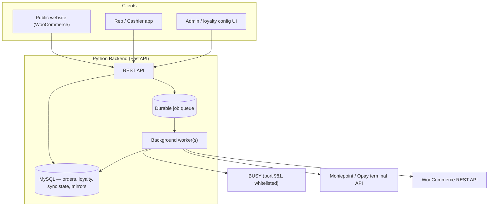

# 15 — Product Requirements Document: BUSY Integration Platform

**Status:** Draft v1 · **Date:** 2026-08-14 · **Owner:** Femtech / Busin
**Prior art:** everything in `../Busin/docs/` (schema findings, connection model, the working
Node.js prototype in `../Busin/code/busy-probe/`) — this PRD specifies the **production Python
rebuild**, using the prototype's validated findings as the spec, not starting from zero.
Curated copies of the essential reference docs live in `docs/reference/`.

---

## 1. Executive Summary

One platform, three connected capabilities, all built on the same BUSY integration layer:

1. **Website sync** — products, stock, and prices flow from BUSY to the e-commerce site
   automatically; new products land as private/draft for review.
2. **Sales order & cashier backend** — the API behind an app where sales reps create orders
   and cashiers take payment and post invoices into BUSY, across all branches.
3. **Loyalty scheme** — a fully dynamic points/tiers/redemption system built on customer
   data pulled from BUSY, configurable by the business without code changes.

**Language decision:** the production backend is **Python** (FastAPI). The Node.js prototype
(`code/busy-probe/`) is retained as a **reference implementation** — it already proved BUSY
connectivity, the real field mappings, the incremental-sync mechanism, and the receipt/voucher
shapes against live data. Section 9 (Migration Plan) covers what carries over.

---

## 2. Background — what's already proven (do not re-derive)

| Fact | Where it's documented |
|---|---|
| BUSY web service: HTTP, header-based, `SC` service codes, XML in/out | `reference/02-service-codes.md`, (`01-overview.md` — archived in `../../Busin/docs/`) |
| Full Master/Voucher type constants | `reference/03-constants.md` |
| Real schema: `Master1` (generic wide table), `Tran1`/`Tran2`, confirmed real Item fields (`SalePrice`, `MainUnit`, `ParentGroup`, `DoNotMaintainStkBal`) | `reference/12-schema-findings.md` |
| Incremental sync via BUSY's own `Stamp` column — proven: 17.3s full pull → 2.2s no-op re-run | `reference/14-command-center.md` |
| Real voucher/receipt shape (customer, items, pricing, broker, accounting entries) confirmed via `GetVchXML` | `reference/14-command-center.md` |
| This company: 8 items, 2 material centers, 3,300+ customers, 4,226+ Sale vouchers, **zero** Salesmen records | `reference/14-command-center.md` |
| Connection/security: BUSY server behind Windows Firewall (not an edge firewall as first suspected); currently port 981 open to any source IP, plaintext, weak password — **must be hardened before production** | `reference/08-windows-deployment.md`, `reference/13-sync-service.md` |
| Moniepoint POS terminal API confirmed (push-to-terminal, idempotent via `merchantReference`, webhook + poll confirmation) | `reference/10-pos-integration-proposal.md` |
| Cashier/order/receipt UX design (Checkout Queue, phone-number lookup, no QR) | `reference/11-solution-overview.md` |

**Sprint breakdown:** this PRD describes *what*; [`docs/sprints/`](sprints/README.md) describes
*when*, in 10 bounded units of work. **Engineering rules for all of the above are in
[`../CLAUDE.md`](../CLAUDE.md) — read it before writing any code.**

---

## 3. Goals

- **G1:** Website product catalog, stock, and price stay in sync with BUSY, automatically, with new products gated behind manual review.
- **G2:** Sales reps and cashiers, across all branches, operate entirely through the app — never BUSY directly — and every finalized sale is a real BUSY voucher with a real BUSY invoice number.
- **G3:** A dynamic loyalty scheme accrues and redeems points based on real purchase data, configurable by business rules, not code.
- **G4:** None of the above degrades reliability of BUSY itself — single-instance constraint respected via queueing and incremental sync throughout.

### Non-goals (this phase)
- Stock-quantity sync — the derivation *mechanism* was decoded 2026-08-15 against real
  `Tran2` data (`app/domain/catalog/stock.py`, CLAUDE.md §8), but the resulting numbers
  are unverified against BUSY's own GUI-displayed stock and nothing is wired into the
  catalog sync yet. Still a non-goal for this phase until that verification happens.
- Automated payment gateway (Paystack) integration — **TBD, not in this PRD's scope**.
- Full accounting/reconciliation dashboards (designed conceptually in `10`, not built here).

---

## 4. System Architecture



- **API** — synchronous, fast, talks only to `DB` (never blocks on BUSY directly except where noted in §7).
- **Worker(s)** — drain the queue: BUSY sync (incremental, `Stamp`-based), voucher posting, WooCommerce push, Moniepoint polling.
- **DB** — MySQL in production (SQLite was fine for the local prototype; MySQL for concurrent app access — see NFRs).

---

## 5. Feature 1 — Website Sync (Catalog / Stock / Price)

**Behavior** (unchanged from `reference/13-sync-service.md`, re-specified for Python):
- Price changes on existing products → push live to WooCommerce immediately.
- New products → created in WooCommerce as `private`, with category, pending manual publish.
- Everything incremental via `Stamp` checkpoints (per entity, persisted in `sync_state`).

### Data model
```
products        (busy_code PK, name, price, unit, item_group, tracks_stock, is_active, woo_product_id, updated_at)
categories      (busy_group_name PK, woo_category_id)
sync_state      (entity PK, last_stamp, updated_at)
```

### API endpoints

| Method | Path | Purpose |
|---|---|---|
| `GET` | `/api/v1/products` | List products (query: `search`, `category`, `active`) |
| `GET` | `/api/v1/products/{code}` | Single product detail |
| `GET` | `/api/v1/categories` | Item groups |
| `POST` | `/api/v1/sync/products` | Trigger sync now — body `{ "full": bool }` (admin/ops only) |
| `GET` | `/api/v1/sync/status` | Checkpoint state per entity, last run time/result |

---

## 6. Feature 2 — Sales Order & Cashier Backend

Full flow per `reference/11-solution-overview.md`: rep creates order → Checkout Queue → cashier finds by
phone lookup or the queue → payment (cash / Moniepoint / Opay) → **payment confirmed before
BUSY sale posts** → BUSY assigns the official invoice number → receipt printed from BUSY data.

### Data model
```
orders          (id PK, order_code, branch_code, customer_phone, customer_name,
                  status[pending|paid|posted|cancelled], created_by, created_at)
order_items     (id PK, order_id FK, item_code, qty, unit_price)
payments        (id PK, order_id FK, method[cash|card|transfer], amount,
                  terminal_ref, status[pending|confirmed|failed], confirmed_at)
vouchers        (busy_vch_code PK, vch_type, vch_no, date, party_code, party_name,
                  material_center_code, amount, cancelled, order_id FK NULL, updated_at)
outbox          (id PK, job_type, payload_json, status[queued|running|done|failed],
                  attempts, idempotency_key, created_at, updated_at)
```

`outbox` is the durable queue — every BUSY write (post sale, post receipt) and every
Moniepoint push is a row here first, so a crash mid-post never loses or duplicates work
(`idempotency_key` = order code, matching the pattern already proven for Moniepoint's
`merchantReference`).

**Built ahead of schedule:** a minimal version of `outbox` (generic `job_type`/`payload`
dispatch, currently just `"add_voucher"`) plus `POST /api/v1/quotations` (Sale Quotation,
`VchType=26`), `GET /api/v1/quotations`, and `GET /api/v1/outbox/{id}` exist already, built
ad hoc at explicit request rather than in this feature's normal Sprint 3/4 sequence — see
`app/outbox/`, `app/domain/orders/quotations.py`. The Sale Quotation XML shape is
**confirmed** against real BUSY (CLAUDE.md §8). Orders/payments/vouchers below are still
unbuilt; the outbox worker is generic enough that Sprint 3/4 should extend it, not replace
it.

**Also built ahead of schedule:** a minimal `users` table (`app/db/models.py`) and JWT auth
(`app/domain/auth/`, `POST /api/v1/auth/users`, `POST /api/v1/auth/login`), each user tied
to exactly one Material Center — this is NFR6 (§8 NFRs table below) pulled forward from
Sprint 5, at explicit request, so the quotation endpoints above could be scoped to a real
identity rather than free-text caller input. `POST /api/v1/quotations` now requires this
token and always uses the caller's own material center; `GET /api/v1/quotations` is scoped
to it.

**Extended further, 2026-08-20, still at explicit request, still ahead of Sprint 5:**
- `User.is_superadmin` — `POST /api/v1/auth/users` now requires an authenticated
  superadmin rather than being open to any caller (the gap flagged in the paragraph above
  is closed). The very first superadmin has no HTTP path by design — bootstrap it with
  `scripts/create_superadmin.py`. A cross-branch dashboard (`GET /api/v1/admin/users`,
  `/admin/quotations`, `/admin/sales-people`, served at `/admin`) lets a superadmin see
  everything rather than only their own material center.
- Sales people credited on a quotation, distinct from the logged-in `User` (several
  people may share one till/login) — **first built wrong** as a table we owned
  (`sales_people`, callers could create rows into it), corrected same day: this is a real
  BUSY master (`Salesman` in `app/db/models.py`), synced read-only exactly like Material
  Center. **Also initially mis-mapped to the wrong `MasterType`** — guessed BUSY's generic
  "Executive"/Salesmen master (`MasterType=33`, genuinely empty for this company), but a
  live GUI screenshot ("List of Engineer") proved this company actually repurposes
  `MasterType=19` ("Broker" generically) for that role — confirmed by an exact 13-name
  live match, see CLAUDE.md §8 for the full story, including a caveat about whether it's
  tied to a branch (it isn't, as far as the schema shows) and that this MasterType mapping
  is company-specific, not a BUSY-wide constant. `GET /api/v1/sales-people` lists BUSY's
  own synced list; there is no create/edit endpoint. Still stored in the outbox job's own
  payload, **not** in the BUSY XML — there is no confirmed Narration/Remarks field on
  `SaleQuotation` to carry it.
- `Product.barcode` — local-only, **not** BUSY data. Live-checked 2026-08-20: this
  company's real Item master has no barcode field populated anywhere (CLAUDE.md §8).
  Assigned via `PUT /api/v1/products/{code}/barcode` (superadmin-only); the console's
  scan input matches against it client-side to auto-select an item row.

### API endpoints

**Orders (sales rep)**
| Method | Path | Purpose |
|---|---|---|
| `POST` | `/api/v1/orders` | Create an order (items, branch, customer phone/name) → returns `order_code` |
| `GET` | `/api/v1/orders?branch=&status=` | Checkout Queue — pending orders for a branch |
| `GET` | `/api/v1/orders/lookup?phone=` | Find order(s) by customer phone (cashier handoff) |
| `GET` | `/api/v1/orders/{code}` | Order detail |
| `DELETE` | `/api/v1/orders/{code}` | Cancel a pending (unpaid) order |

**Payment & finalize (cashier)**
| Method | Path | Purpose |
|---|---|---|
| `POST` | `/api/v1/orders/{code}/payment/cash` | Record cash tendered → triggers finalize |
| `POST` | `/api/v1/orders/{code}/payment/terminal` | Push amount to Moniepoint/Opay terminal (`terminalSerial`, `paymentMethod`) |
| `GET` | `/api/v1/orders/{code}/payment/status` | Poll terminal payment confirmation |
| `POST` | `/api/v1/webhooks/moniepoint` | Moniepoint `V1_POS_TRANSACTION` webhook (alternative to polling) |
| `GET` | `/api/v1/orders/{code}/receipt` | Finalized receipt (from BUSY's own data, once posted) |

**Vouchers (browse, any type — generalized from the Node prototype)**
| Method | Path | Purpose |
|---|---|---|
| `GET` | `/api/v1/vouchers?type=&branch=&from=&to=` | List vouchers of any BUSY VchType |
| `GET` | `/api/v1/vouchers/{code}/receipt` | On-demand full receipt (BUSY `SC=8`, never bulk-fetched) |

**Reference data**
| Method | Path | Purpose |
|---|---|---|
| `GET` | `/api/v1/customers/search?phone=` | Customer lookup for order creation |
| `GET` | `/api/v1/material-centers` | Branches |
| `GET` | `/api/v1/sale-types` | Sale type templates |
| `GET` | `/api/v1/sales-people` | This company's "Engineer" list (BUSY `MasterType=19`/Broker, repurposed — CLAUDE.md §8; not the generic Executive master, which is empty here) — built ahead of schedule, see above |

**Ops**
| Method | Path | Purpose |
|---|---|---|
| `GET` | `/api/v1/admin/queue` | Outbox depth, in-flight, failed jobs |
| `POST` | `/api/v1/admin/queue/{job_id}/retry` | Manually retry a failed job |

---

## 7. Feature 3 — Loyalty Scheme (dynamic)

**"Dynamic" means:** tiers and earn/redeem rules are **rows of data**, evaluated by a generic
rules engine at transaction time — changing the points rate, adding a tier, or running a
"double points weekend" is an API call to `/loyalty/rules`, not a deploy.

### Data model
```
loyalty_customers   (busy_customer_code PK, phone, name, tier_id FK, points_balance,
                      lifetime_points, enrolled_at)
loyalty_tiers       (id PK, name, rank, min_lifetime_points, points_multiplier,
                      benefits_json, is_active)
loyalty_rules       (id PK, name, type[earn|redeem], scope_json  -- e.g. branch/category filter
                      formula_json  -- e.g. {"points_per_currency": 0.01}
                      active_from, active_to, priority, is_active)
loyalty_transactions(id PK, customer_code FK, type[earn|redeem|adjust|expire],
                      points, related_vch_code, rule_id FK NULL, branch_code, created_at, note)
```

**Rule evaluation (earn):** triggered automatically when a Sale voucher posts (via the same
`outbox` worker) — the engine finds active rules matching the sale's branch/category/date,
computes points via `formula_json`, and writes a `loyalty_transactions` row + updates the
customer's balance and (if crossed a threshold) tier.

**Rule evaluation (redeem):** cashier applies points at checkout; engine validates balance,
computes the discount value, writes the transaction, and the discount feeds into the sale
amount posted to BUSY (as a Bill Sundry / discount line — same pattern as the `Discount`
`BSDetail` seen in real Sale XML, see `reference/04-examples.md`).

### API endpoints

| Method | Path | Purpose |
|---|---|---|
| `GET` | `/api/v1/loyalty/customers/{code}` | Profile — points, tier, lifetime points |
| `GET` | `/api/v1/loyalty/customers/{code}/history` | Full transaction ledger |
| `POST` | `/api/v1/loyalty/customers/{code}/enroll` | Enroll an existing BUSY customer |
| `GET` | `/api/v1/loyalty/customers/export` | **Full customer + loyalty data export** (the "get all customer details" requirement) — CSV/JSON, all fields, all customers |
| `GET` | `/api/v1/loyalty/tiers` | List tiers |
| `POST` / `PUT` | `/api/v1/loyalty/tiers` / `/{id}` | Create/edit a tier — **no code change needed** |
| `GET` | `/api/v1/loyalty/rules` | List earn/redeem rules |
| `POST` / `PUT` | `/api/v1/loyalty/rules` / `/{id}` | Create/edit a rule (e.g. promo periods, category multipliers) |
| `POST` | `/api/v1/loyalty/redeem` | Cashier redeems points against an order |
| `GET` | `/api/v1/loyalty/reports/summary` | Points issued/redeemed, tier distribution, top customers |

---

## 8. Non-Functional Requirements

| # | Requirement | Why (already learned) |
|---|---|---|
| NFR1 | Every BUSY write goes through the `outbox` queue, never inline in a request | Single BUSY instance, serialized — proven concern throughout `05`, `13` |
| NFR2 | Every job has an idempotency key (order code / `merchantReference`) | Prevents double-posting on retry — same principle as Moniepoint integration |
| NFR3 | All BUSY reads default to incremental (`Stamp`-based) | Proven 8× faster, near-zero BUSY load on no-op runs (`14`) |
| NFR4 | Blocked/deactivated BUSY records marked `is_active`, never silently dropped | Bug found and fixed in the prototype (`14`) |
| NFR5 | Dedicated BUSY service account, own voucher series, BUSY auto-numbering on | Avoids collisions with the 30+ human BUSY users, clean audit trail |
| NFR6 | Cashier identity stamped into the voucher narration | BUSY's own `CreatedBy` will show only the shared service account otherwise |
| NFR7 | Port 981 restricted to the backend's IP; strong BUSY password | **Currently failing** — flagged repeatedly, must fix before go-live |
| NFR8 | Receipt data always sourced from BUSY post-write, never fabricated client-side | "Receipt from BUSY" requirement from `reference/10-pos-integration-proposal.md` |

---

## 9. Migration Plan — Node prototype → Python production

| Node prototype piece | Python equivalent | Carries over as |
|---|---|---|
| `src/busyClient.js` | `busy_client.py` (httpx) | Same header-based call pattern, same SC codes |
| `src/xmlUtil.js` (`parseRowsetXml`, `parseElementXml`) | `xml_util.py` (lxml/ElementTree) | Same two parser shapes, same entity-decoding fix (numeric refs!) |
| `src/catalogSync.js` (`Stamp` checkpoint logic) | `sync/incremental.py` | Same `sync_state` table design, same `is_active` fix |
| `src/wooClient.js` | `woo_client.py` | Same seed-mode safety net logic |
| `catalog.db` (SQLite) | MySQL | Schema carries over near 1:1, adds `orders`/`loyalty_*`/`outbox` |
| `public/index.html` command center | Internal ops/debug tool only — not the production app | Kept as-is for BUSY debugging |

The Node prototype is **not thrown away** — it stays as the validated reference and the fastest
way to re-verify a BUSY behavior question during the Python build.

---

## 10. Phased Rollout

1. **Phase 1:** Python API skeleton + BUSY client + incremental sync ported (catalog only) → re-validates Feature 1 in Python.
2. **Phase 2:** Orders/payments/outbox queue + Moniepoint integration, one pilot branch.
3. **Phase 3:** Loyalty engine (tiers/rules/ledger) + customer export.
4. **Phase 4:** Roll out to remaining branches; harden BUSY connection security (NFR7).

---

## 11. Scale Planning — this BUSY company is the test bed; production target is retail at ~100× the data

Everything proven so far (schema, `Stamp` incremental sync, receipt shapes, timings) was validated
against the **repair-centre company** — a genuinely small dataset. The **production target is a
retail business at roughly 100× this volume.** That changes some engineering decisions:

| | Repair centre (proven) | Retail (~100×, projected) | What changes |
|---|---:|---:|---|
| Items | 8 | ~800+ | Per-item `GetMasterXML` detail fetch (1 call/item) becomes the bottleneck on first sync — see below |
| Customers | 3,376 | ~330,000+ | Bulk SQL still works, but **must be paginated** — one unbounded query returning 300k+ rows risks timeouts/memory |
| Sale vouchers | 4,226 | ~400,000+ | Same — paginate by `Stamp` ranges (e.g. 5,000 rows/page, loop until exhausted) rather than one giant query |
| Material Centers (branches) | 2 | ~200 | The outbox queue's throughput and **queue-depth monitoring/alerting become critical**, not optional |

**Concrete adjustments needed before retail onboarding:**
- **Paginate every bulk sync query** (`TOP N` / `Stamp` windowing) instead of one unbounded `SELECT`.
- **Revisit decoding `Master1`'s generic columns for Items.** At 8 items, one `GetMasterXML` call
  per item was trivial. At ~800+, that's 800+ sequential calls just for the first full sync —
  worth the earlier-deferred effort of decoding what `D1..D26`/`C1..C7` mean for `MasterType=6`
  directly from bulk SQL, cutting N calls down to 1.
- **MySQL indexing** on `(busy_code)`, `(stamp)`, `(material_center_code)`, `(date)` for every
  synced table — not optional at this row count.
- **Queue-depth alerting**, not just the queue itself — with ~200 branches posting concurrently,
  visibility into "is the backlog growing faster than BUSY can drain it" is a day-one requirement.

**The one honest, unresolved risk:** we still have **zero measured write latency** against BUSY
(`SC=2`, posting a voucher) — every test this whole engagement has been deliberately read-only.
At 100× transaction volume, whether BUSY can keep up with the outbox queue's write rate is the
single biggest open technical risk in this PRD, and it can only be answered by measuring, not
estimating. **Recommend posting one real test voucher and timing it before retail onboarding
begins** — this has been offered twice and not yet actioned.

---

## 12. Credit Sales & Partner Reconciliation

**Model:** no credit-limit logic on our side — **the credit partner's own acceptance is the
approval gate.** Once a partner approves a purchase, the sale proceeds; we don't separately
underwrite it.

### How this maps onto BUSY (using its own native mechanism)

Same `BillByBillBalancing` / `PendingBillDetails` mechanism from §Background — applied
deliberately here:

- Each credit partner is its own **Account (Party)** record in BUSY (`MasterType=2`), exactly
  like a walk-in customer — grouped under a dedicated **Account Group: "Credit Partners"**
  (parallel to however walk-in customers are grouped today), each with `BillByBillBalancing=True`.
- **The Sale voucher's party (`MasterName1`) is the credit partner's account, not the end
  consumer** — because the partner is who now owes the business the money, per their own
  settlement terms, once they've approved the purchase. This is the same pattern already used
  for walk-in customers — just pointed at a different kind of party.
- The **end-consumer's identity is still captured** — in the order/narration and our own
  database — for warranty, receipts, and loyalty purposes, even though BUSY's receivable sits
  against the partner's account.
- Settlement, when the partner pays, is a **Receipt voucher against that partner's account**,
  referencing the specific bill(s) — exactly how any other bill-by-bill receivable clears in BUSY.

### Example credit partners (researched, illustrative — not yet confirmed as signed partners)

| Partner | Model | Source |
|---|---|---|
| **CredPal** | Largest BNPL merchant network in Nigeria (13,000+ merchants incl. Shoprite, Slot) | [Pulse.ng](https://www.pulse.ng/story/buy-now-pay-later-platforms-2025071707523617870) |
| **Carbon (Carbon Zero)** | Fintech-backed BNPL checkout product | [Punch](https://punchng.com/startups-offer-payment-options-for-struggling-nigerian-consumers/) |
| **EasyBuy (Newedge)** | BNPL finance partner, notably integrated with Jumia Nigeria | [Yahoo Finance](https://finance.yahoo.com/news/jumia-nigeria-launches-two-buy-120000261.html) |
| **CDCare** | Pay-in-installments-before-delivery model (50% upfront, balance over time) | [Pulse.ng](https://www.pulse.ng/story/buy-now-pay-later-platforms-2025071707523617870) |
| **Klump** | "Pay with Klump" checkout BNPL, Lagos-based | [Rest of World](https://restofworld.org/2022/nigerians-are-learning-to-buy-now-and-pay-later/) |
| **PayWithSpecta** | Sterling Bank's BNPL arm | [MyCouponTap](https://mycoupontap.com/buy-now-pay-later-platforms/) |
| **M-Kopa** | Asset-financing BNPL, historically strong specifically in **phones/devices** — natural fit for an electronics retailer | [Rest of World](https://restofworld.org/2022/nigerians-are-learning-to-buy-now-and-pay-later/) |

### Reconciliation — the same three-way pattern, per partner

```
Partner's settlement/payout report  ↔  BUSY pending bills (that partner's account)  ↔  BUSY receipts
```

Exceptions surfaced automatically: approved-by-partner-but-not-yet-posted (lag), overdue pending
bill vs. the partner's own stated payment schedule, or receipted-but-disputed.

### Data model additions
```
credit_partners        (id PK, busy_account_code, name, settlement_terms_note, is_active)
credit_partner_bills   (id PK, partner_id FK, busy_vch_code, amount, due_date,
                          status[pending|receipted|overdue|disputed], updated_at)
```

### API endpoints

| Method | Path | Purpose |
|---|---|---|
| `GET` | `/api/v1/credit-partners` | List configured partners |
| `POST` | `/api/v1/credit-partners` | Add a partner (creates the BUSY Account under "Credit Partners" group) |
| `GET` | `/api/v1/credit-partners/{id}/bills` | Pending/settled bills for one partner |
| `POST` | `/api/v1/credit-partners/{id}/reconcile` | Import a partner's settlement report (CSV/API) and match against pending bills |
| `GET` | `/api/v1/credit-partners/reconciliation/exceptions` | Cross-partner exceptions report |

---

## 13. Open Questions

- ☐ Payment gateway for **online** (website) checkout — Paystack is off; nothing confirmed yet.
- ☑ MySQL hosting target — **decided 2026-08-21**: cPanel shared hosting, same account's
  MySQL (via cPanel's MySQL Databases tool), not a separate managed DB or VPS. This
  shaped a real architectural decision: the in-process background loops
  (`CATALOG_SYNC_ENABLED`/`OUTBOX_WORKER_ENABLED`) aren't relied on in this deployment —
  a Passenger-managed process isn't guaranteed to stay resident — cPanel Cron Jobs
  calling `scripts/drain_outbox_once.py`/`run_catalog_sync_once.py` do the same work
  instead. See `DEPLOYMENT.md`.
- ☐ Loyalty redemption at POS: does it need cashier approval/limits, or fully self-service?
- ☐ Who owns approving new-tier/new-rule changes in the loyalty admin UI?
- ☐ Which credit partners are actually being signed (the 7 above are researched examples, not confirmed)?
- ☐ Does each credit partner offer an API/webhook for approval + settlement reporting, or is it manual (CSV/portal) per partner?
- ☑ Real BUSY write latency (`SC=2`) — **measured 2026-08-15**: ~700-760ms write, ~1.2-1.3s round trip to confirmed-readable (Sale Quotation only, see CLAUDE.md §8). Still worth re-measuring for a real Sale (VchType=9) before Sprint 4, since that also posts ledger/stock updates a Quotation doesn't.
- ☑ Sale Quotation XML shape (`<SaleQuotation>`, `VchType=26`) — **confirmed 2026-08-15** via a live test post (CLAUDE.md §8). Turned up a real bug (VchNo must be pre-computed for this company), now fixed.
- ☐ Stock derivation from `Tran2` — mechanism decoded 2026-08-15 (`app/domain/catalog/stock.py`, CLAUDE.md §8) but the computed numbers have never been checked against BUSY's own GUI-displayed stock for any item. Needed before wiring this into the catalog sync.
