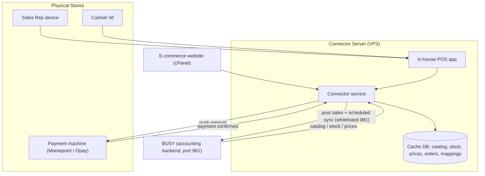
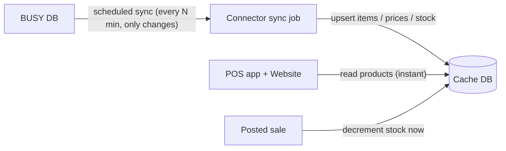
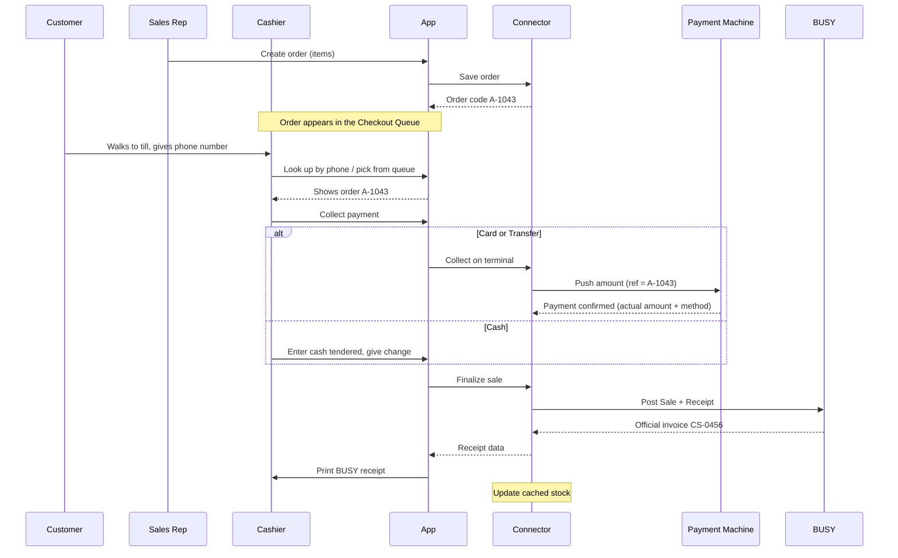
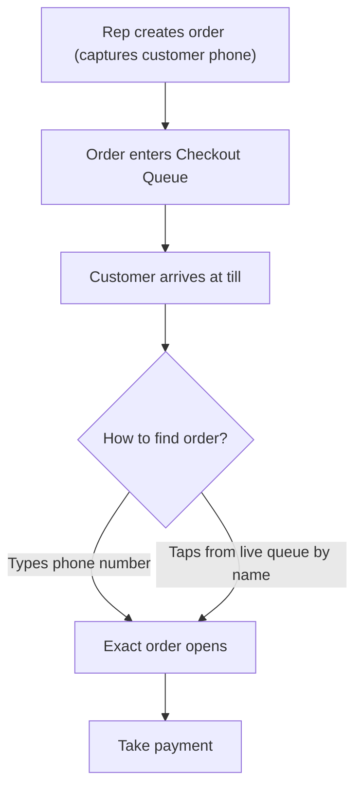
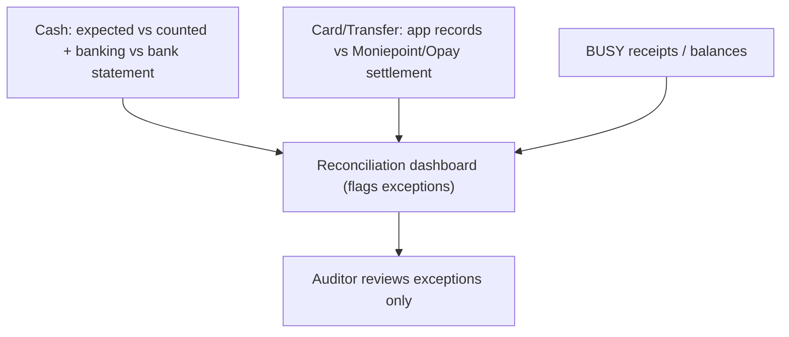

# 11 — The whole idea: solution overview & flowcharts

A single picture of the system: **BUSY is the accounting backend, one in‑house app is the only screen
staff use, a connector with its own cache database sits in the middle**, and payments are taken by
integrating directly with the Moniepoint/Opay machines. Includes Mermaid diagrams for flowcharts.

---

## 1. The core idea

- **BUSY = backend / system of record.** It records every sale and issues the official invoice number.
- **One in‑house app** for sales reps and cashiers (and the public website for online). Nobody touches
  BUSY directly.
- **A connector** is the single pipe to BUSY. It also holds a **cache database** so the app is fast and
  BUSY is never hammered.
- **Payment machines** (Moniepoint/Opay) are driven by the connector: it pushes the amount to the
  terminal and waits for automatic confirmation.
- **Receipts come from BUSY** — the sale is saved to BUSY first, and the printed receipt uses BUSY's
  invoice number and data.

## 2. Where everything runs (connector NOT on the BUSY server)

Assumption: we are **not** allowed to install the connector on the BUSY server. So the connector lives
on its **own server (VPS)**, and the BUSY server simply **whitelists that one server's IP** on port 981.

- **Connector server (VPS):** the connector service + the in‑house POS app + the cache database.
- **BUSY server (existing Windows box):** unchanged except a firewall rule allowing the VPS IP on 981.
- **Store devices:** plain browsers/tablets opening the app over the network (HTTPS).
- **Public website:** stays on cPanel; it calls the connector's API.

## 3. How we avoid slow, repeated pulls from BUSY (the cache)

BUSY's web service is slow and has no push. So we **poll it once, centrally**, and everyone reads a
fast local copy:

- A **scheduled sync job** in the connector pulls **changed** items/prices/stock from BUSY every few
  minutes into the **cache DB**.
- The **app and website read products from the cache** — instant, no BUSY round‑trip.
- When a sale is posted, the connector **updates the cached stock immediately**, so it stays fresh
  between syncs.

**What is cached vs live:**

| Data | Source | How the app gets it |
|------|--------|---------------------|
| Product catalog, prices | BUSY → cache | Read from cache (instant) |
| Stock levels | BUSY → cache, updated on each sale | Read from cache (near‑real‑time) |
| Posting a sale | App → connector → BUSY | Live write (must confirm) |
| Official invoice number / receipt | BUSY → connector → app | Live, at finalize |

## 4. The in‑store sale flow

## 5. How the customer reaches the right cashier (no QR)

Customers here are not tech‑inclined, so **no QR codes**. Two mechanisms used **together**:

1. **Phone‑number lookup** — the customer gives their phone number at the till; the cashier types it and
   the exact order opens (the rep captured the number when creating the order).
2. **Live Checkout Queue** — the cashier's screen always shows pending orders (customer name + items +
   code); the cashier can also just tap the right one.

## 6. Payments & reconciliation

- **Cash** → reconciled by drawer count: app computes expected, cashier blind‑counts, variance is
  automatic; banked cash matches the bank statement. (Worked example in
  [10-pos-integration-proposal.md](10-pos-integration-proposal.md) Appendix A.)
- **Card / Transfer on the machine** → the order code is the machine's `merchantReference`, so each
  payment is confirmed live and matched daily against the Moniepoint/Opay settlement report.
- **BUSY** holds the authoritative balances; a dashboard flags only the exceptions.

## 7. Reliability principles (no room for error)

- No BUSY sale is created until **payment is confirmed**.
- The **amount is pushed to the terminal** by the app — cashiers never type it on the machine.
- **Idempotency** everywhere: `merchantReference` at the terminal, `order code → invoice` at BUSY.
- **Receipt from BUSY** — paper always equals the ledger.
- **Durable queue + retry** — a momentary BUSY hiccup never loses a paid sale.
- **Cache** keeps the app fast and shields BUSY from load.

## 8. Open items

- ☐ Confirm connector runs on its own VPS; get the **VPS static IP whitelisted** on BUSY's port 981.
- ☐ Choose the **cache database** (e.g. MySQL) and the **sync interval**.
- ☐ Confirm reps capture the **customer phone number** on every order (needed for lookup).
- ☐ Payment provider **API keys** + each **terminalSerial** (Moniepoint/Opay).
- ☐ Per‑branch **Material Center** + **Voucher Series**, and BUSY **auto‑numbering** on.
